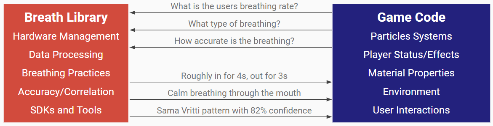

Adventures In Breath
====================

*We create games that make people breathe.*

Adventures in Breathe is a platform that embeds breath therapeutics from breath work, yoga, meditation, martial arts, and health/wellbeing practices into immersive game play.

## What is the Breath Library?

A developer plugin to handle detecting and processing a users breath.

See the Technical Overview here:
- [Google Slide Show](https://docs.google.com/presentation/d/1DgyVn3C-NJYVlhoHBXkjvRmYYvaiEjpjvubrIIAeMbA/edit?usp=sharing)
- [Video](https://youtu.be/XEglCmU3p08)

## What does the Breath Library do?

- Manages Hardware Devices and Input
- Estimates Breathing through inference
- Defines breathing patterns/practices
- Calculates the correlation of breaths
- Records overarching statistics
- Provides easy-to-use SDK